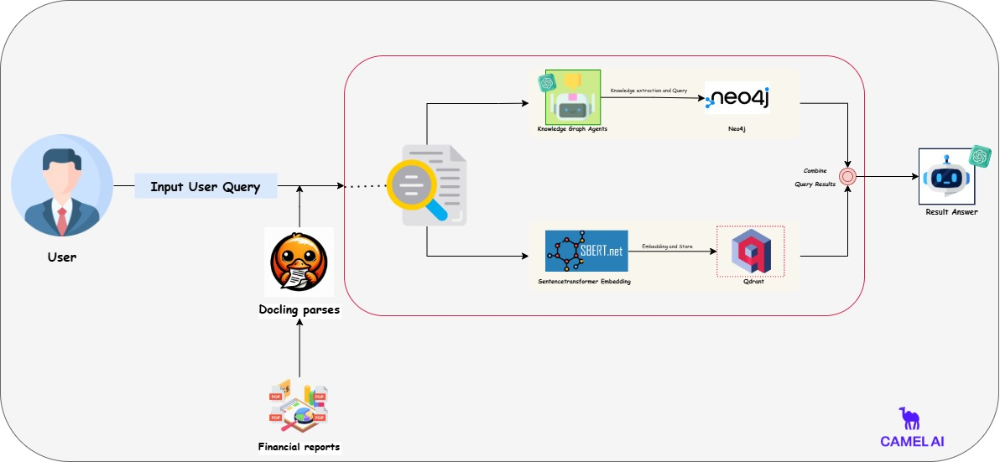

# Graph RAG Project

This project is designed to process strategy reports and sample company information, transform this data into a knowledge graph, and respond to user queries. The project handles documents in PDF and Markdown formats, extracts information from these documents, and creates a knowledge graph for efficient data representation and querying.

> **Note:** This project does not provide investment strategies. It is solely for informational and research purposes.

---
## Project Diagram

## Project Structure

- **data/**: 
  - Contains strategy reports and sample company information in `.md` and `.pdf` formats.

- **parse/**: 
  - Includes the `parser.py` script, which converts PDF files into Markdown format.
  - Performs OCR (Optical Character Recognition) and table structure extraction for enhanced data processing.

- **graph.ipynb**: 
  - A Jupyter notebook that:
    - Creates a knowledge graph from processed data.
    - Implements vector-based information retrieval for querying.
    - Processes user queries and generates responses using NLP models.

---

## Key Features

1. **PDF to Markdown Conversion**:
   - Converts PDF documents to Markdown using `parser.py`.
   - Supports OCR for scanned documents and retains table structures.

2. **Knowledge Graph Creation**:
   - Extracts data from Markdown files and organizes it into a knowledge graph using Neo4j or a similar graph database.

3. **Vector-Based Query Processing**:
   - Retrieves relevant information using embeddings (e.g., SentenceTransformers).
   - Combines retrieved data with the knowledge graph for enriched responses.

---

## Technologies Used

### **Docling**
[Docling](https://github.com/DS4SD/docling) is utilized in this project for document parsing and format conversion. It enables efficient extraction of content from PDFs and converts them into Markdown format, maintaining structural elements like tables and reading order.

Key Docling Features Used:
- OCR support for scanned PDFs.
- Advanced table structure extraction.
- Unified document representation for seamless processing.

### **CAMEL-AI**
[CAMEL-AI](https://github.com/camel-ai/camel) is integrated into the project to enable multi-agent systems for query processing. CAMEL facilitates interaction between the vector-based retriever and the knowledge graph agent to generate meaningful and context-aware responses.
